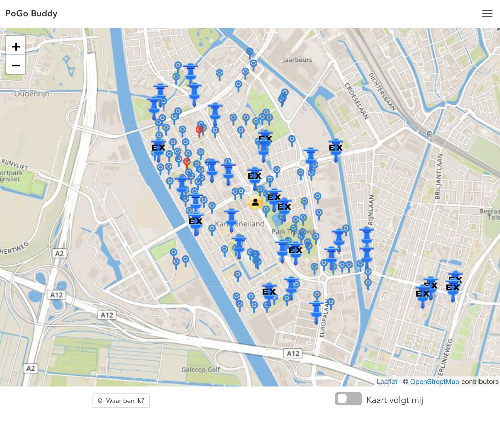

# Pogo Buddy
Please note; this is experimental. It requires an API which is not yet available here. 



## Project setup
```
npm i
```
### Modify API URL and mapping service URL
- Copy src/example.settings.js to src/settings.js
- Edit src/settings.js

### Compiles and hot-reloads for development
```
npm run serve
```

### Compiles and minifies for production
```
npm run build
```

### Run your tests
```
npm run test
```

### Lints and fixes files
```
npm run lint
```

### Run your unit tests
```
npm run test:unit
```
